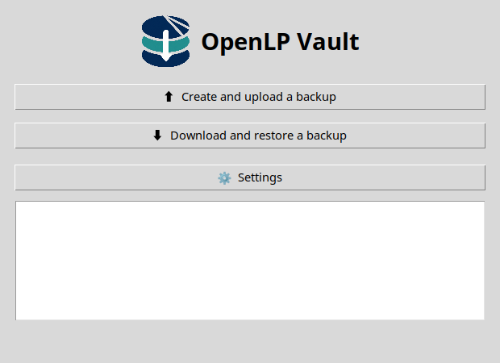
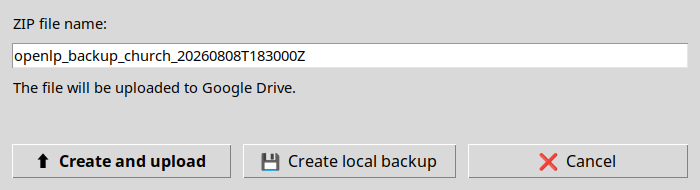
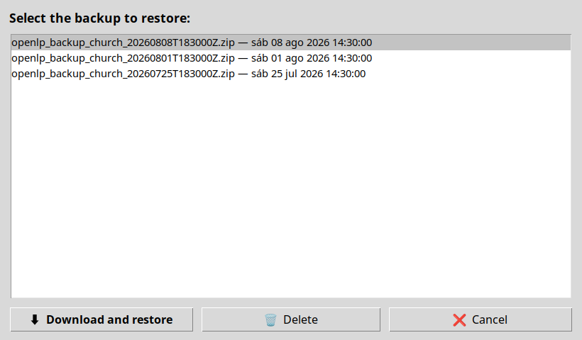
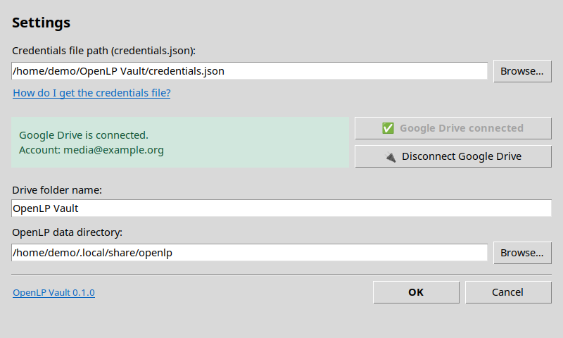

# Usage guide

English | [Español](../es/usage.md)

## Desktop interface

Create Google Drive credentials by following the
[Google Drive setup guide](drive_setup.md).

Launch the application with:

```bash
openlp-vault-gui
```

If no reusable OAuth token exists, Settings opens on first launch. Provide:

- The path to `credentials.json`.
- The OpenLP data directory.
- The Google Drive folder name; the default is `OpenLP Vault`.

The main window can:

- Create and upload a backup.
- Create a local backup only.
- List, download, and restore backups.
- Delete Drive backups.
- Reopen Settings or disconnect Google Drive.

Settings are stored in `~/.openlp-vault/config.json`, and the OAuth token is
stored in `~/.openlp-vault/token.json`.

### Screenshots

Main window:



Create and upload a backup:



Download and restore a backup:



Settings:



## Command-line interface

```bash
openlp-vault --help
```

Available commands are `auth`, `backup`, `restore`, and `delete`.
There is no `discover` command; discovery runs automatically when `backup`
or `restore` needs a path.

### Authentication

After following the [Google Drive setup guide](drive_setup.md), run:

```bash
openlp-vault auth --credentials credentials.json
```

Relevant options:

- `--credentials FILE` — Google OAuth credentials file.
- `--token-path PATH` — Alternative token read/write location.
- `--debug` — Detailed logging.

### OpenLP directory discovery

The application checks `OPENLP_PATH` before platform-specific defaults. A
path is accepted if it contains at least one of `songs`, `bibles`,
`images`, or `presentations`.

```bash
OPENLP_PATH=/path/to/openlp openlp-vault backup --no-upload
```

The backup command also accepts a path directly:

```bash
openlp-vault backup --source /path/to/openlp
```

### Backup

Create a local temporary ZIP without uploading it:

```bash
openlp-vault backup --no-upload
```

Create and upload a backup to the `OpenLP Vault` folder:

```bash
openlp-vault backup
```

Choose another Drive folder or a known parent:

```bash
openlp-vault backup --folder-name "OpenLP Backups"
openlp-vault backup --parent-folder-id FOLDER_ID
```

Generated names begin with `openlp_backup_`. After a successful upload, the
temporary ZIP is removed.

### Restore

List backups and copy the displayed `id`:

```bash
openlp-vault restore --list-only
```

Restore that backup:

```bash
openlp-vault restore \
  --backup-id BACKUP_ID \
  --destination /path/to/openlp
```

When `--destination` is omitted, OpenLP Vault attempts discovery and prompts
for a path if necessary. Restore replaces the destination directory with the
ZIP contents, so close OpenLP first.

The CLI currently provides neither interactive backup selection for restore
nor a `--snapshot-dir` option.

### Delete

List backups and select one interactively:

```bash
openlp-vault delete
```

Delete a known backup:

```bash
openlp-vault delete --backup-id BACKUP_ID
```

Skip confirmation:

```bash
openlp-vault delete --backup-id BACKUP_ID --force
```

Deletion from Google Drive cannot be undone through OpenLP Vault.

## Development installation

OpenLP Vault requires Python 3.10 or later:

```bash
python -m pip install -r requirements.txt
python -m pip install -e .
```

You can also run `./setup.sh`, which creates `.venv`, installs
dependencies, and installs the package in editable mode.

## Legal and project information

The CLI help includes a short license reference. Display copyright, license,
maintenance, contact, and project URL with:

```bash
openlp-vault license
```

In the GUI, click the underlined `OpenLP Vault VERSION` text in Settings to
open **About OpenLP Vault**. The dialog links to the maintainer email and
<https://ucbtrigales.github.io/openlp-vault/>, and provides scrollable views
of `LICENSE` and `NOTICE`.
