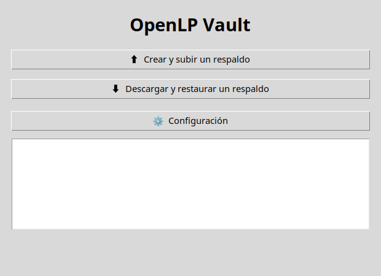
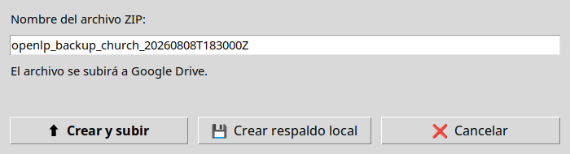
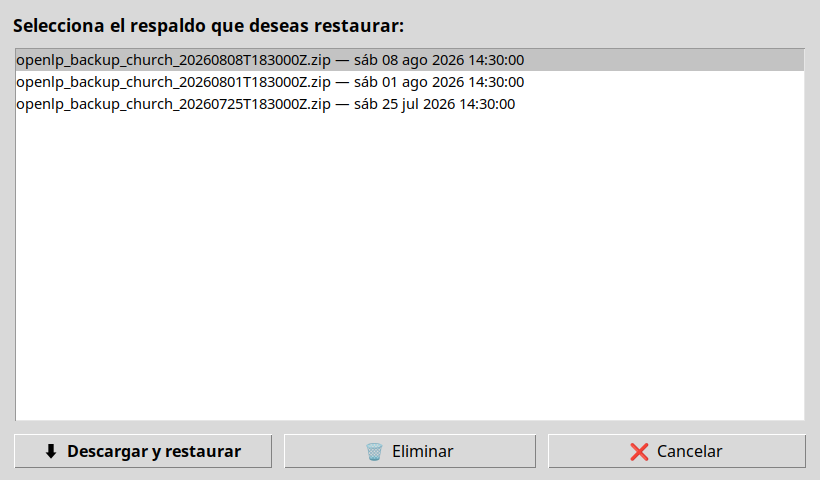
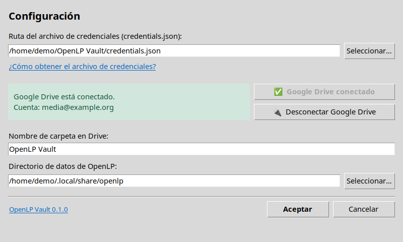

# Guía de uso

[English](../en/usage.md) | Español

## Instalación para desarrollo

```bash
python -m pip install -r requirements.txt
python -m pip install -e .
```

También puedes ejecutar `./setup.sh`, que crea `.venv`, instala las
dependencias y deja el paquete en modo editable.

## Idioma

La GUI y la CLI admiten inglés y español. El idioma se obtiene exclusivamente
de las variables estándar del sistema, en este orden:

1. `LC_ALL`
2. `LC_MESSAGES`
3. `LANG`

Las variantes regionales se reducen al idioma base. Por ejemplo,
`es_CL.UTF-8` y `es_ES.UTF-8` usan español. Si ninguna variable indica un
idioma compatible, se utiliza inglés.

```bash
LANG=es_CL.UTF-8 openlp-vault --help
LANG=en_US.UTF-8 openlp-vault-gui
```

No existe un selector de idioma en la GUI ni una opción específica de idioma.

## Información legal y del proyecto

La ayuda de la CLI incluye una referencia breve a la licencia. Para mostrar
copyright, licencia, mantenimiento, contacto y URL del proyecto, ejecuta:

```bash
openlp-vault license
```

En la GUI, pulsa el texto subrayado `OpenLP Vault VERSIÓN` de Configuración
para abrir **Acerca de OpenLP Vault**. El diálogo enlaza al correo del
mantenedor y a <https://github.com/ucbtrigales/openlp-vault>, y permite
consultar `LICENSE` y `NOTICE` en vistas desplazables.

## Interfaz gráfica

Inicia la aplicación con:

```bash
openlp-vault-gui
```

Si no hay un token OAuth reutilizable, la ventana de configuración se abre en
la primera ejecución. Debes indicar:

- La ruta de `credentials.json`.
- El directorio de datos de OpenLP.
- El nombre de la carpeta de Google Drive; por defecto, `OpenLP Vault`.

Desde la ventana principal se puede:

- Crear y subir un respaldo.
- Crear solamente un respaldo local.
- Consultar, descargar y restaurar respaldos.
- Eliminar respaldos de Drive.
- Abrir nuevamente la configuración o desconectar Google Drive.

La configuración se guarda en `~/.openlp-vault/config.json` y el token OAuth
en `~/.openlp-vault/token.json`.

### Capturas de pantalla

Ventana principal:



Crear y subir un respaldo:



Descargar y restaurar un respaldo:



Configuración:



## Interfaz de línea de comandos

```bash
openlp-vault --help
```

Los comandos disponibles son `auth`, `backup`, `restore` y `delete`.
No existe un subcomando `discover`: el descubrimiento se ejecuta
automáticamente cuando `backup` o `restore` necesitan una ruta.

### Autenticación

Después de crear las credenciales según
[la guía de Google Drive](drive_setup.md), ejecuta:

```bash
openlp-vault auth --credentials credentials.json
```

Opciones relevantes:

- `--credentials FILE` — Archivo OAuth de Google.
- `--token-path PATH` — Ubicación alternativa para leer o guardar el token.
- `--debug` — Registro detallado.

### Descubrimiento del directorio de OpenLP

La aplicación consulta primero `OPENLP_PATH` y después las rutas habituales
de Linux, macOS o Windows. Una ruta se acepta si contiene al menos uno de los
directorios `songs`, `bibles`, `images` o `presentations`.

```bash
OPENLP_PATH=/ruta/a/openlp openlp-vault backup --no-upload
```

También se puede proporcionar la ruta directamente:

```bash
openlp-vault backup --source /ruta/a/openlp
```

### Respaldo

Crear un ZIP local temporal sin subirlo:

```bash
openlp-vault backup --no-upload
```

Crear y subir un respaldo a la carpeta `OpenLP Vault`:

```bash
openlp-vault backup
```

Elegir otra carpeta de Drive o un padre conocido:

```bash
openlp-vault backup --folder-name "Respaldos OpenLP"
openlp-vault backup --parent-folder-id ID_DE_LA_CARPETA
```

Los nombres generados comienzan por `openlp_backup_`. Tras una subida
correcta, el ZIP temporal se elimina.

### Restauración

Primero consulta los respaldos y toma el valor mostrado como `id`:

```bash
openlp-vault restore --list-only
```

Después restaura el respaldo indicando su ID:

```bash
openlp-vault restore \
  --backup-id ID_DEL_RESPALDO \
  --destination /ruta/a/openlp
```

Si se omite `--destination`, se intenta detectar el directorio de OpenLP y,
si no se encuentra, se solicita la ruta. La restauración reemplaza el
directorio de destino con el contenido del ZIP; cierra OpenLP antes de
continuar.

### Eliminación

Listar los respaldos y seleccionar uno interactivamente:

```bash
openlp-vault delete
```

Eliminar uno conocido por ID:

```bash
openlp-vault delete --backup-id ID_DEL_RESPALDO
```

Omitir la confirmación:

```bash
openlp-vault delete --backup-id ID_DEL_RESPALDO --force
```

La eliminación en Google Drive no se puede deshacer desde OpenLP Vault.
